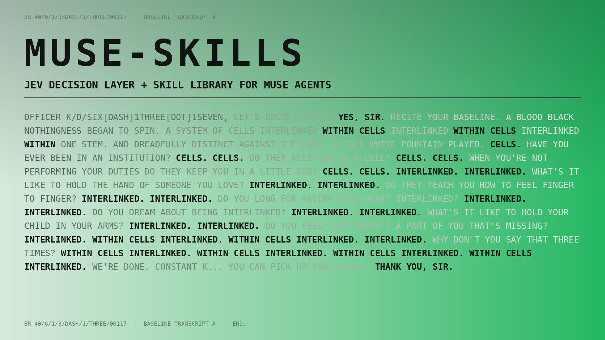

# muse-skills

[](LICENSE)
[](docs/setup.md)
[](skills/jev-router/)



An agent that asks for a second opinion before it acts. This repo wires
TypeSafe Jev into an agent's decision loop through a shadow-mode router,
and ships the 23-skill library the router learns to choose between.

The core loop is small: before an expensive or irreversible step, the
agent asks Jev a typed question. Choice, Score, or Boolean, always with
probabilities. The answer is logged. In shadow mode the action proceeds
anyway; in active mode the verdict is enforced. You calibrate the
thresholds from your own logs, not from documentation.

## 60 seconds

One command. It clones the repo, installs the Jev decision layer and all
23 skills into `~/workspace/skills/`, and leaves the demo and docs in
`~/workspace/muse-skills/`:

```bash
curl -fsSL https://raw.githubusercontent.com/theglitcharchitect/muse-skills/main/install.sh | bash
cd ~/workspace/muse-skills && python3 demo/run.py
```

No key, no network. The demo runs against a deterministic mock gateway and
walks through four real decisions using the actual gate scripts. To go
live, set `VERCEL_AI_GATEWAY_KEY` and run it again; the mock steps aside.
Full setup in [docs/setup.md](docs/setup.md). Manual install: `git clone`
this repo and copy `skills/*` into your skills directory.

## What the demo shows

```
ACT 1  Boolean: the safety gate on a risky command
  tool:    shell_exec
  args:    rm -rf ~/workspace/drafts
  risk score         2 / 2 (confidence 0.92)
  safe to run        p = 0.03
  Jev verdict        BLOCK

ACT 2  Choice: two plans, one decision
  Jev choice         PLAN B
  probabilities      plan_b 0.78, plan_a 0.22

ACT 3  Score: a draft against an evidence rubric
  evidence score     1 / 3 (confidence 0.68)
  weak rungs         1
  Jev verdict        REVISE

ACT 4  Router: shadow mode gates an expensive browser run
  Jev choice         escalate
  probabilities      escalate 0.81, proceed 0.12, skip 0.07
  Jev decision       ESCALATE
  Shadow mode: the run proceeds, the decision is logged.
```

Four typed evaluations, three real gate scripts, one log per decision.

## How it fits together


Three layers. The **skill library** (`skills/`) is inert knowledge: 23
playbooks an agent can load. The **decision layer**
(`skills/jev-router/bin/`) asks Jev typed questions before expensive steps:
the usage router gates actions, the safety gate classifies tool calls, the
judge scores drafts against a rubric, and smaller gates handle retries,
spend, triage, and skill selection. The **human** authorizes anything
irreversible. Spending, sending, deleting, and publishing always escalate
to a person, in both modes.

Every evaluation returns a probability distribution, and every decision is
appended to `logs/*.jsonl` with the margin between the top two options. A
0.91/0.05 split and a 0.51/0.49 split must not look the same when you
calibrate. If the gateway is unreachable, every gate fails toward the
human, never toward silent approval. The full walkthrough is in
[docs/architecture.md](docs/architecture.md).

## The skill catalog

| Skill | What it does |
|---|---|
| `jev-router` | Typed Jev evaluations plus the shadow-mode usage router. The decision layer. |
| `superhumanizer` | Strip AI writing tells; rewrite in a natural human voice. |
| `tweet-forge` | Draft X posts from a finding plus its numbers. Fill in `config/` first. |
| `self-audit` | Answer questions about your own agent by checking sources, not introspecting. |
| `stealth-browser` | How bot detectors fingerprint automation; how to behave like a real user. |
| `map-ranking-systems` | Model ranking and moderation systems with evidence tiers. |
| `delta-watch` | Structured intel-briefing workflow. Configure for your own region. |
| `crowdcast` | Multi-agent social simulations for prediction and exploration. |
| `bullshit-detector` | Score claims against a rubric; ingestion to publishing pipeline. |
| `satori` | A clinically informed companion for hard questions. |
| `artifact-craft` | Quality bar for web artifacts: hierarchy, charts, interactivity, a11y. |
| `artifacts-builder` | Build interactive frontend artifacts and dashboards. |
| `frontend-design` | Aesthetic direction that avoids templated defaults. |
| `theme-factory` | Ten preset themes plus on-the-fly generation for artifacts. |
| `kinetic-typography` | Variable-font animation, split-text reveals, scroll-driven text. |
| `scroll-driven-storytelling` | Scrollytelling pages with reduced-motion fallbacks. |
| `canvas-design` | Posters and static art in PNG/PDF, with bundled open fonts. |
| `docx` / `pptx` / `xlsx` / `pdf` | Read, write, and repair Office documents and PDFs. |
| `invoice-organizer` | Sort messy receipts into a tax-ready structure. |
| `cloudflare` | Pages deploys and the provider API. |

One skill was left out: `newsroom-admin` was bound to a specific site and
credential workflow and could not be genericized. The full audit is in
[docs/sanitization-notes.md](docs/sanitization-notes.md).

## Shadow mode, the philosophy

A gate you cannot calibrate is a random number generator with confidence.
So every gate ships in shadow mode: it judges each decision and logs the
verdict, but enforces nothing. You read the log, score it against your own
judgment, set your thresholds from the disagreement rate, and only then
flip `config.json` to active. An `examples/` folder shows what a
calibration pass reads like.

The principle behind the mechanism: Jev advises, the human authorizes.
The router makes the person's decision faster and better informed. It
never makes it for them.

[docs/shadow-mode.md](docs/shadow-mode.md) says the rest.

## Contributing

Open an issue before a large change. New gates ship shadow-first and
stdlib-only. No credentials in the repo, ever. Details in
[CONTRIBUTING.md](CONTRIBUTING.md).
