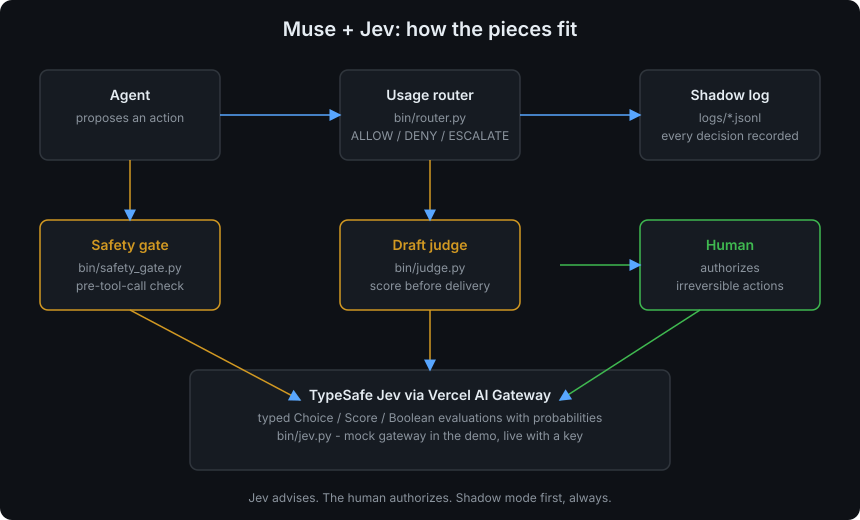

# Architecture

How Jev, the router, and the skill library fit together.

## The three layers

**1. The skill library (`skills/`).** Twenty-three skills, each a self-contained
playbook: a `SKILL.md` that tells an agent when to use it and how, plus any
scripts, references, and config it needs. Skills are inert knowledge. They do
not decide anything on their own.

**2. The decision layer (`skills/jev-router/bin/`).** This is the new part.
Before an expensive or irreversible step, the agent asks TypeSafe Jev for a
typed evaluation:

| Script | Question it asks | When it runs |
|---|---|---|
| `router.py` | Should this action run now? (Choice: proceed / skip / escalate) | before expensive actions: browser runs, research passes, retries, publishes, sends, deletes |
| `safety_gate.py` | Is this tool call safe? (Boolean) How risky? (Score 0-2) What should happen? (Choice) | before any tool call the agent wants classified |
| `judge.py` | Does this draft meet the rubric? (Score) Is it ready? (Boolean) Deliver, revise, or hold? (Choice) | before a draft goes out |
| `retry_adjudicate.py` | Retry, abandon, or replan? | when an attempt fails |
| `spend_gate.py` | Approve, review, or deny this spend? | before purchases |
| `triage.py` | Which notifications deserve attention? | notification handling |
| `select_skill.py` | Which skill fits this task best? | before expensive skill runs |
| `ask_check.py` | Is this a well-formed Jev question? | before asking Jev anything |

Every evaluation returns probabilities, not just a verdict. The margin
between the top two options is logged with every decision, because a
0.91/0.05 split and a 0.51/0.49 split must not look the same at
calibration time.

**3. The human.** Jev advises, the human authorizes. Irreversible actions
(spending, sending, deleting, publishing) always escalate to a person. The
router has a kill switch (`"enabled": false` in `config.json`) and a
deterministic hard deny-list that runs before any Jev call.

## How a decision flows

1. The agent proposes an action, e.g. a 12-page browser sweep.
2. The relevant gate script builds a typed question set (see
   `skills/jev-router/references/question-library.md`) and sends it to Jev
   through `bin/jev.py`, which talks to the Vercel AI Gateway.
3. Jev returns one answer per question: a choice with a probability
   distribution, a score, a boolean with a probability.
4. The gate maps the answers to a verdict (allow / deny / escalate, or
   approve / block, or deliver / revise / hold) and appends the full record,
   probabilities and latency included, to `logs/*.jsonl`.
5. In **shadow mode** the verdict is logged and the action proceeds anyway.
   In **active mode** the verdict is enforced. See `shadow-mode.md`.

## If the gateway is unreachable

Every gate fails toward the human, never toward silent approval. In active
mode an unreachable gateway escalates (or holds the draft); in shadow mode
it logs. No gate ever prints a traceback instead of a verdict.

## Diagram source

`architecture.svg` is generated by `gen_architecture_diagram.py` in this
directory. Edit the script and re-run it to change the diagram. No image
assets are used anywhere in this repo.
